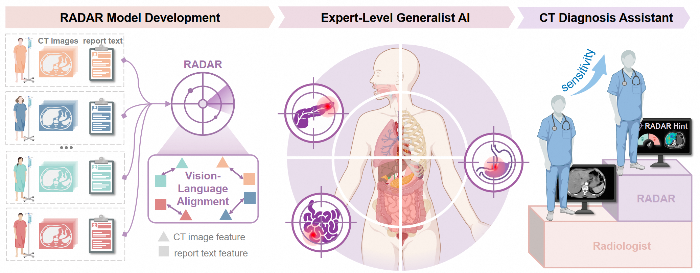

# RADAR: An Expert-Level Generalist AI for Abdominal CT Diagnosis

[](https://github.com/alibaba-damo-academy/damo-radar)
[](https://creativecommons.org/licenses/by-nc-sa/4.0/)
[](.github/workflows/package-integrity.yml)

> **本仓库是 RadarScope** —— RADAR 的非官方衍生版本，做工程化改造：
> 桌面服务端封装、中文交互界面、跨平台一键部署、离线运行。
> 模型权重不随仓库分发，首次运行会引导下载（约 1.9 GB，走国内镜像）。
>
> **请先读[衍生版本声明与许可边界](#衍生版本声明与许可边界)**：本项目沿用上游
> CC BY-NC-SA 4.0，**仅限非商业用途**，且必须保留对原 RADAR 项目的署名。

RADAR is a generalist vision-language model trained on over 400,000 contrast-enhanced abdominal CT examinations with 15 million anatomy-aware image–text pairs, learning directly from clinical reports without manual annotation. RADAR provides a scalable and versatile framework for radiology AI, demonstrating expert-level performance across both routine and complex clinical tasks.

<p align="center">
  
</p>

---

## 衍生版本声明与许可边界

RadarScope 是基于 [DAMO Academy RADAR](https://github.com/alibaba-damo-academy/damo-radar)（*Science* 2026）的**非官方衍生版本**，
在原始项目基础上做了工程化改造（桌面服务端封装、中文交互、离线部署等）。

- **许可**：沿用原项目的 **CC BY-NC-SA 4.0**——**非商业性使用（NonCommercial）+ 相同方式共享（ShareAlike）**，见 `LICENSE`。本版本同样以该许可发布。
- **商用**：任何商业性使用（收费部署、对外服务、嵌入商业产品）需另行取得原版权方授权。
- **用途限制**：仅供科研、教学与算法评估，**不得用于临床诊断**；模型表现仍需前瞻性临床研究验证。
- 第三方组件许可（含 vendored 源码与 LGPL-3.0 运行依赖）见 [`THIRD_PARTY_LICENSES.md`](THIRD_PARTY_LICENSES.md)。

---

## RadarScope 快速部署

本目录是 **RadarScope** 桌面分发包（原 RADAR Desktop），**不内置 Python / PyTorch / 依赖库**。包内只有平台无关文件，安装与启动脚本 `.bat` / `.sh` 双份齐全，**同一个 `RadarScope.zip` 在 Windows 与 Linux 上都能直接部署**。首次部署只需三步：

1. **装环境**：双击运行包根目录的 `setup_env.bat`（Linux 用 `./setup_env.sh`）——按提示选择本机已装的 Python 3.10，脚本会自动在 `RADAR_inference\env` 创建专用虚拟环境并安装全部依赖（默认清华镜像，可选 CUDA 12.9 或 CPU 版 torch）。安装失败直接重跑即可，已完成部分自动跳过。
2. **启动服务**：`RADAR_inference\deploy\start_server.bat`（局域网模式，网内浏览器访问 `http://<本机IP>:8125`）或 `start_server.bat local`（单机模式，自动打开浏览器）。
3. **验证**：详见 [`docs/USER_GUIDE.md`](docs/USER_GUIDE.md) 与 [`RADAR_inference/deploy/README.md`](RADAR_inference/deploy/README.md)。

> 前置要求：Python 3.10.x（本机自备）；NVIDIA GPU 用户建议先装好显卡驱动；Windows 需 VC++ 2015-2019 x64 运行库。

---

## 安装依赖（开发参考）

```bash
pip install -r requirements-desktop.txt
```

> 发布包不含 Python 环境，用户端请运行包根目录的 `setup_env.bat` / `setup_env.sh`，
> 它会自动建虚拟环境并安装全部依赖。清单按实际验证过的运行环境冻结。

---

## 参与贡献

欢迎提 Issue 和 PR。改动 `RADAR_inference/dynamic_network_architectures/`（Apache-2.0）时，
请保留其 `LICENSE` / `NOTICE` 并按 §4(b) 标注改动。

**绝对红线：不要提交任何患者影像或医疗数据**（含官方 demo 病例），
详见 **[SECURITY.md](SECURITY.md)**。

仓库每次 push 都会跑 [.github/workflows/package-integrity.yml](.github/workflows/package-integrity.yml)，
在 Ubuntu 和 Windows 双平台校验：换行符、敏感内容、署名文件完整性、
前端产物是否被追踪、vendored 模块数量。**这些正是本地测不出来、
只有换台机器才会暴露的问题**（例如 Windows 的 `autocrlf` 把 `.sh` 转成 CRLF，
导致 Linux 上 `setup_env.sh` 不可用）。

---

## 获取模型权重

分发包**不含模型权重**（约 3.2 GB），但**含全部文本嵌入**（约 440 KB，见下表）。
首次部署任选一种方式补齐权重：

| 方式 | 操作 |
|---|---|
| 安装时下载（推荐） | 运行 `setup_env.bat` / `setup_env.sh`，检测到权重缺失时会询问并下载 |
| 服务端管理页 | 启动服务后进入管理页的「模型权重」，选择文件点下载（走国内镜像） |
| 命令行 | `python RADAR_inference/scripts/download_weights.py --preset main` |

`--preset` 取值：`main`（默认，约 1.9 GB）/ `plus` / `all`（约 3.5 GB）。
下载走 `hf-mirror.com` 镜像，**支持断点续传**，中断后重跑同一条命令即可继续。
下载完成后服务会卸载已缓存的模型句柄，下次推理直接加载新权重，无需重启。

需要下载的权重（官方仓库 `radar-generalist/RADAR`）：

| 文件 | 大小 | 用途 |
|---|---|---|
| `checkpoint_radar_pretrain.pth` | 1.5 GB | main 模型权重（必需） |
| `bert-base-chinese/` | 393 MB | main 的中文文本编码器（必需） |
| `checkpoint_radar_plus_finetuned_on_merlin.pth` | 1.6 GB | plus 模型权重（可选，AUC 0.918） |
| `checkpoint_radar_plus.pth` | 1.6 GB | plus 从头训练版（可选，AUC 0.888） |

随包分发的文本嵌入

| 文件 | 大小 | 用途 |
|---|---|---|
| `infer_text_embedding_radar.pt` | 340 KB | main 的文本嵌入（必需） |
| `infer_text_embedding_merlin_en.pt` | 48 KB | plus 的文本嵌入（plus 使用时必需） |
| `infer_text_embedding_merlin.pt` | 48 KB | 官方原文件，属「中文 BERT + main」空间，仅作对照 |

> 文本嵌入与权重一一对应，**不能跨权重复用**：换权重（如改用 `checkpoint_radar_plus.pth`）
> 需重新生成对应嵌入，命令见
> [`RADAR_inference/deploy/README.md`](RADAR_inference/deploy/README.md)。
> 官方的 `infer_text_embedding_merlin.pt` 属「中文 BERT + main」空间，**不可**用于 plus。

---

## Documentation

For detailed instructions, please refer to the following guides:

| 文档 | 内容 |
|---|---|
| [`docs/USER_GUIDE.md`](docs/USER_GUIDE.md) | 使用说明：上传、阅片、结果导出 |
| [`docs/API_CONTRACT.md`](docs/API_CONTRACT.md) | HTTP 接口契约、模型与文本嵌入的对应关系 |
| [`docs/DEPLOY_OFFLINE.md`](docs/DEPLOY_OFFLINE.md) | 离线部署与网络依赖说明 |
| [`RADAR_inference/deploy/README.md`](RADAR_inference/deploy/README.md) | 服务端启停、可选权重、参数说明 |

> 官方原项目的训练与预处理指南未随本包分发：本包只含推理服务端，不含训练代码。

---

## Acknowledgements

This project is built upon the following open-source projects:

- [LAVIS](https://github.com/salesforce/LAVIS) (BSD 3-Clause License)
- [nnU-Net](https://github.com/MIC-DKFZ/nnUNet) (Apache License 2.0)
- [MONAI](https://github.com/Project-MONAI/MONAI) (Apache License 2.0)
- [3D-ResNets-PyTorch](https://github.com/kenshohara/3D-ResNets-PyTorch) (MIT License)

---

## License

This project is released under the [CC BY-NC-SA 4.0](LICENSE).

Portions of the code are derived from third-party open-source projects that are distributed under their own licenses (see the [Acknowledgements](#acknowledgements) above). Their original license texts are retained in [`THIRD_PARTY_LICENSES.md`](THIRD_PARTY_LICENSES.md).

`RADAR_inference/dynamic_network_architectures/` 沿用上游 Apache-2.0（其中 `med.py` 为 LAVIS 的 BSD-3-Clause），不适用 CC BY-NC-SA 4.0；其 `LICENSE` 与 `NOTICE` 随包保留在同目录内。前端构建产物内含 Cornerstone3D（MIT）、VTK.js（BSD-3-Clause）等宽松许可组件。详见 `THIRD_PARTY_LICENSES.md`。

> ⚠ **发布时用 `pack_release.ps1` 生成发布包**，它会按白名单打包，自动排除模型权重、
> `data/demo_cases/`（真实患者影像）、虚拟环境与管理员凭据。**不要直接压缩源目录。**
> 该脚本仅供维护者使用，不随包分发。
>
> 若同时发布 GitHub 仓库：`pack_release.ps1` 会校验「zip 内每个文件都被 git 追踪」，
> 避免只发仓库时缺文件（历史上 `frontend/dist/` 曾被 `dist/` 规则误伤，
> 会导致服务能启动但页面打不开）。换行符由 `.gitattributes` 按类型锁定：
> `.sh` 强制 LF，`.bat` 强制 CRLF。

---

> The Radar model is currently intended for research purposes only. Further improvements and prospective clinical studies are still required before it can be used directly for clinical deployment.

---
## Citation

本包为衍生版本，若在研究中使用了 RADAR 模型，请引用原论文：

```bibtex
@article{damo-radar-2026,
    author = {Qi Zhang and Jianpeng Zhang and Weiwei Cao and Zilin Lu and Wanxing Chang and Haonan Ding and Cao Chen and Zhi Li and Xing Xue and Sinuo Wang and Shaoteng Zhang and Yutong Xie and Yong Xia and Qi Wu and Zhongyi Shui and Xi Li and Zhilin Zheng and Yanjie Zhou and Tony C.W. Mok and Yingda Xia and Hongkan Wang and Xianghua Ye and Tao Ma and Jie Peng and Xiaoguang Wang and Jian Ding and Yuming Gao and Huazhen Ye and Yiping Liu and Dongjie Chen and Zhaomin Ni and Jianwen Ning and Wei Zhang and Jian Liu and Chaohui Yu and Shenghong Ju and Jianfeng Zhang and Wenbo Xiao and Ling Zhang and Tingbo Liang },
    title = {An expert-level generalist AI for abdominal CT diagnosis},
    journal = {Science},
    volume = {393},
    number = {6817},
    pages = {eaec6129},
    year = {2026},
    doi = {10.1126/science.aec6129},
    URL = {https://www.science.org/doi/abs/10.1126/science.aec6129}
}
```
